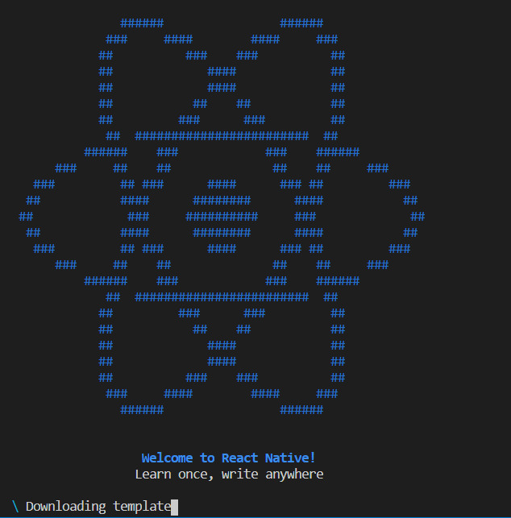
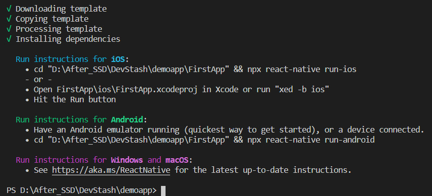
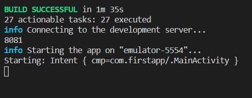
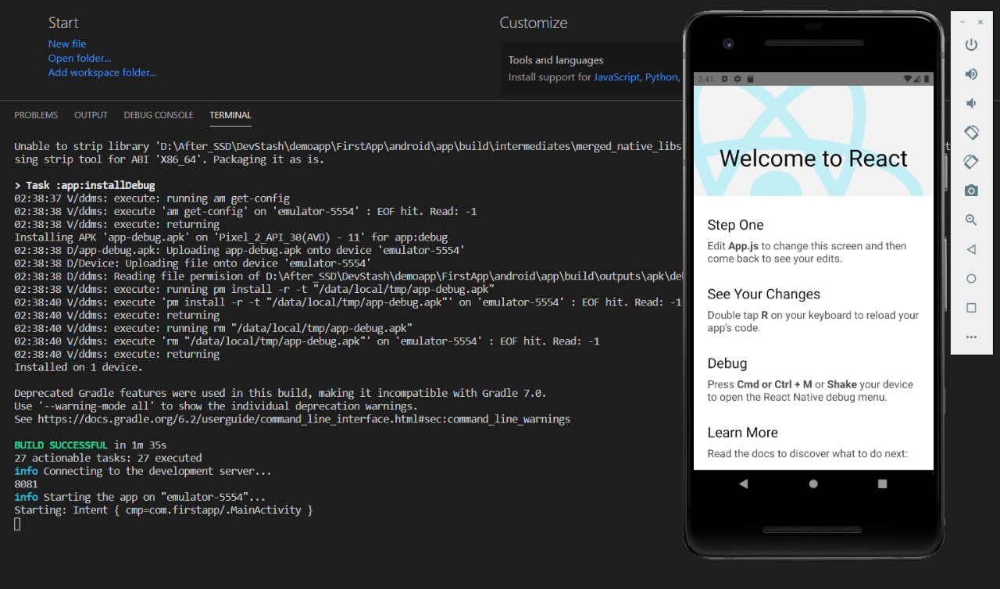

Welcome to the kickstart session on react native.

In the upcomming sessions we will be using use React Native CLI. It requires Xcode or Android Studio to get started.  
If you already have one of these tools installed, you should be able to get up and running within a few minutes.  
If they are not installed, you should expect to spend about an hour installing and configuring them.  

This tutorial assumes that you have Android studio with an virtual device or a physical device configured to android studio , up and running also you must have node installed on your machine.  

# Creating a new application

#If you previously installed a global react-native-cli package, please remove it as it may cause unexpected issues.  

React Native has a built-in command line interface, which you can use to generate a new project. You can access it without installing anything globally using npx, which ships with Node.js.  

#Before attempting to write any command make sure that your emulator is running or your physical device is connected and configured to your pc(Enable USB debugging from developers options in your phone in case of a physical device).  

Let's create a new React Native project called "FirstApp":  
S-1. Create a new folder with a app name and open VS code in the current folder  
S-2. Once in the current folder on VS code open a new terminal from the top toolbar  
S-3. In the current termical execute - npm install react-native-cli  
S-4. In the termical copy the following command - npx react-native init FirstApp  

  

S-5. FirstApp is the name of your newly created app , the setup process may take a while to finish depending on internet speed.In case you face any issues try googling  it or drop a text in whatsapp group  
  
  

# Running your app
Once your setup has been completed , move to your app directory and execute the folloowing command based on your machine type.  
 Windows - npx react-native run-android  
 IOS - npx react-native run-ios — simulator=”iPhone X”  
 
   
 
   

# Modifying your app 

Now that you have successfully run the app, let's modify it.  

    S-1. Open App.js in your VS Code and edit some lines as per your choice to see the changes happening on your device.  
    S-2. Press the R key twice or select Reload from the Developer Menu (Ctrl + M) to see your changes!  

That's it!  

Congratulations! You've successfully run and modified your first React Native app.  

